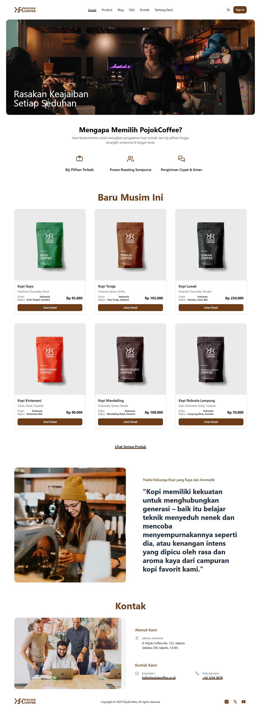
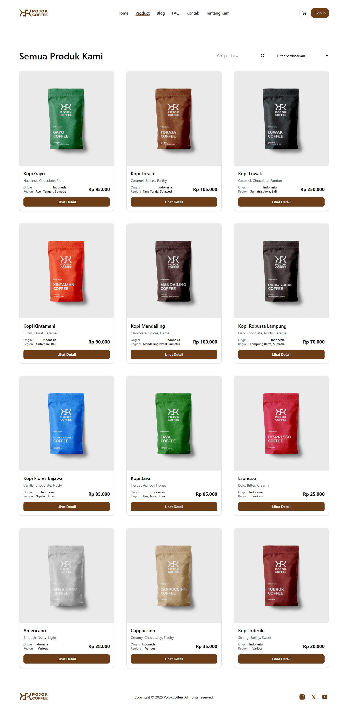
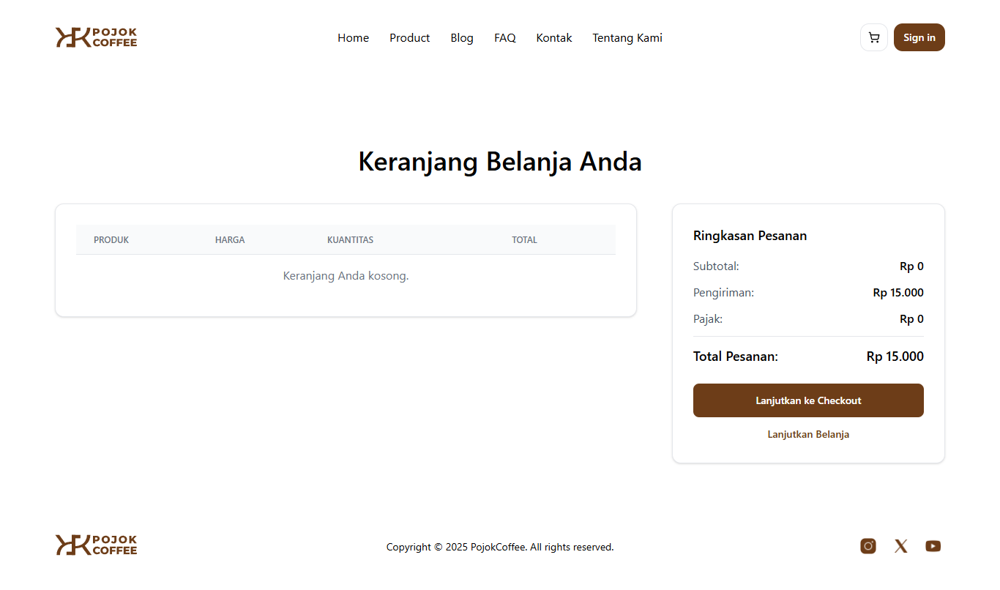

# PojokCoffee - Toko Kopi Online


PojokCoffee adalah platform e-commerce sederhana yang didedikasikan untuk para pecinta kopi. Kami menawarkan berbagai biji kopi pilihan dari seluruh Indonesia, memungkinkan pengguna untuk menjelajahi produk, menambahkan ke keranjang, dan melakukan checkout dengan mudah. Selain itu, kami juga menyediakan blog informatif seputar dunia kopi dan halaman-halaman penting lainnya seperti FAQ, Kebijakan Pengembalian, dan Syarat & Ketentuan.

Proyek ini dibangun sebagai demonstrasi frontend murni menggunakan HTML, Tailwind CSS, dan JavaScript vanilla.

## Daftar Isi

*   [Fitur Utama](#fitur-utama)
*   [Teknologi yang Digunakan](#teknologi-yang-digunakan)
*   [Struktur Proyek](#struktur-proyek)
*   [Cara Menjalankan Proyek](#cara-menjalankan-proyek)
*   [Fungsionalitas Keranjang Belanja](#fungsionalitas-keranjang-belanja)
*   [Fungsionalitas Blog](#fungsionalitas-blog)
*   [Area untuk Peningkatan](#area-untuk-peningkatan)
*   [Kontribusi](#kontribusi)
*   [Lisensi](#lisensi)
*   [Kontak](#kontak)

## Fitur Utama

*   **Halaman Beranda Interaktif**: Menampilkan produk unggulan, testimoni, dan informasi kontak.
*   **Daftar Produk Lengkap**: Halaman khusus untuk melihat semua produk dengan fitur pencarian dan filter (berdasarkan harga dan popularitas).
*   **Halaman Detail Produk**: Informasi rinci tentang setiap produk, termasuk tasting notes, asal, wilayah, dan opsi untuk menambahkan ke keranjang.
*   **Keranjang Belanja Fungsional**: Tambah, hapus, dan ubah kuantitas item di keranjang. Perhitungan subtotal, biaya pengiriman, pajak, dan total pesanan.
*   **Proses Checkout Sederhana**: Formulir informasi pengiriman dan pilihan metode pembayaran (simulasi).
*   **Konfirmasi Pesanan**: Halaman ringkasan pesanan setelah checkout berhasil.
*   **Blog Informatif**: Artikel-artikel tentang kopi dengan halaman daftar dan detail.
*   **Halaman Informasi Lengkap**: Tentang Kami, FAQ, Kontak, Syarat & Ketentuan, Kebijakan Privasi, Kebijakan Pengembalian, dan Kebijakan Pengiriman.
*   **Autentikasi (Frontend Saja)**: Halaman Sign In, Register, dan Lupa Kata Sandi (tanpa fungsionalitas backend).
*   **Loader Halaman**: Animasi loading yang halus untuk meningkatkan pengalaman pengguna.
*   **Desain Responsif**: Tampilan yang optimal di berbagai ukuran layar (desktop, tablet, mobile).

## Teknologi yang Digunakan

*   **HTML5**: Struktur dasar halaman web.
*   **Tailwind CSS**: Framework CSS utility-first untuk styling yang cepat dan responsif (diimpor via CDN).
*   **Preline UI**: Library komponen UI berbasis Tailwind CSS untuk elemen interaktif (diimpor via CDN).
*   **JavaScript (Vanilla JS)**: Untuk semua fungsionalitas interaktif dan manipulasi DOM.
*   **LocalStorage**: Digunakan untuk menyimpan data keranjang belanja di sisi klien.
*   **Google Fonts**: Untuk tipografi yang konsisten.
*   **Google Analytics**: Untuk pelacakan penggunaan situs.


## Demo

Lihat bagaimana PojokCoffee bekerja!

### Tangkapan Layar

Berikut adalah beberapa tangkapan layar dari halaman-halaman utama:

*   **Halaman Beranda:**
    

*   **Halaman Produk:**
    

*   **Keranjang Belanja:**
    

## Cara Menjalankan Proyek

Proyek ini adalah frontend murni, sehingga sangat mudah untuk dijalankan:

1.  **Clone repositori ini:**
    ```bash
    git clone https://github.com/hasbihasbullh/pojokcoffee.git
    ```
    (Ganti `hasbihasbullh` dengan username GitHub Anda)

2.  **Masuk ke direktori proyek:**
    ```bash
    cd pojokcoffee
    ```

3.  **Buka file `index.html` di browser Anda.**
    Anda bisa langsung mengklik dua kali file `index.html` atau menggunakan ekstensi "Live Server" di VS Code untuk pengalaman pengembangan yang lebih baik.

## Fungsionalitas Keranjang Belanja

Keranjang belanja diimplementasikan menggunakan JavaScript dan `localStorage` browser.

*   **`assets/js/script.js`**: Berisi logika utama untuk menambah, memperbarui, dan menghapus item dari keranjang, serta menyimpan status keranjang ke `localStorage`.
*   **`assets/js/products.js`**: Menyediakan data produk statis yang digunakan di seluruh situs.
*   **`bag.html`**: Menampilkan detail keranjang dan memungkinkan interaksi pengguna.
*   **`checkout.html`**: Memproses ringkasan pesanan dari keranjang.

## Fungsionalitas Blog

Konten blog dimuat secara dinamis dari file JavaScript.

*   **`assets/js/blog-data.js`**: Berisi data artikel blog statis.
*   **`blog.html`**: Menampilkan daftar semua artikel blog.
*   **`blog-detail.html`**: Menampilkan konten lengkap dari artikel blog tertentu berdasarkan ID.

## Area untuk Peningkatan

Proyek ini adalah titik awal yang bagus, namun ada beberapa area kunci yang dapat ditingkatkan untuk menjadikannya aplikasi web yang lebih lengkap dan kuat:

*   **Integrasi Backend**: Mengimplementasikan server-side untuk manajemen pengguna (registrasi, login, otentikasi), penyimpanan data produk dan pesanan di database, serta pemrosesan pembayaran yang sebenarnya.
*   **Manajemen Inventaris**: Menambahkan sistem untuk melacak stok produk.
*   **Sistem Pembayaran Nyata**: Mengintegrasikan gateway pembayaran pihak ketiga (misalnya Midtrans, Stripe, PayPal).
*   **Validasi Formulir Lanjutan**: Validasi sisi server untuk semua input pengguna.
*   **Manajemen Konten (CMS)**: Memungkinkan admin untuk menambah, mengedit, atau menghapus produk dan artikel blog tanpa mengubah kode.
*   **Fitur Pengguna**: Dashboard pengguna yang lebih lengkap (riwayat pesanan, alamat tersimpan, dll.).
*   **Peningkatan Pencarian & Filter**: Filter yang lebih canggih (berdasarkan kategori, rating, dll.).
*   **Optimasi Performa**: Bundling dan minifikasi aset CSS dan JavaScript untuk waktu muat yang lebih cepat.
*   **Pengujian**: Menulis tes unit dan integrasi untuk memastikan fungsionalitas bekerja dengan benar.
*   **Aksesibilitas**: Melakukan audit dan perbaikan untuk memastikan situs dapat diakses oleh pengguna dengan disabilitas.
*   **Quick View Modal**: Mengimplementasikan fungsionalitas untuk modal "Quick View" di halaman produk.

## Kontribusi

Kontribusi sangat dihargai! Jika Anda ingin berkontribusi pada proyek ini, silakan ikuti langkah-langkah berikut:

1.  Fork repositori ini.
2.  Buat branch baru (`git checkout -b feature/nama-fitur-baru`).
3.  Lakukan perubahan Anda.
4.  Commit perubahan Anda (`git commit -m 'Tambahkan fitur baru'`).
5.  Push ke branch Anda (`git push origin feature/nama-fitur-baru`).
6.  Buat Pull Request.

## Lisensi

Proyek ini dilisensikan di bawah [MIT License](LICENSE).

## Kontak

Jika Anda memiliki pertanyaan atau saran, jangan ragu untuk menghubungi kami:

*   **Email**: mhasbihasbullah@gmail.com
*   **GitHub**: [hasbihasbullh](https://github.com/hasbihasbullh)

---

Terima kasih telah mengunjungi PojokCoffee! Selamat menikmati kopi Anda.
